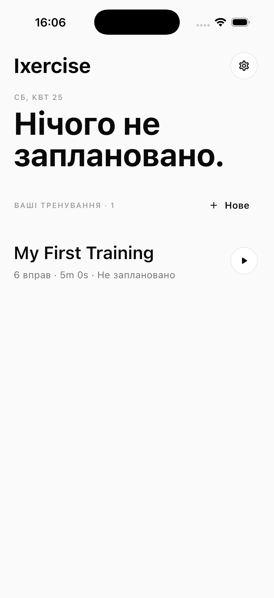
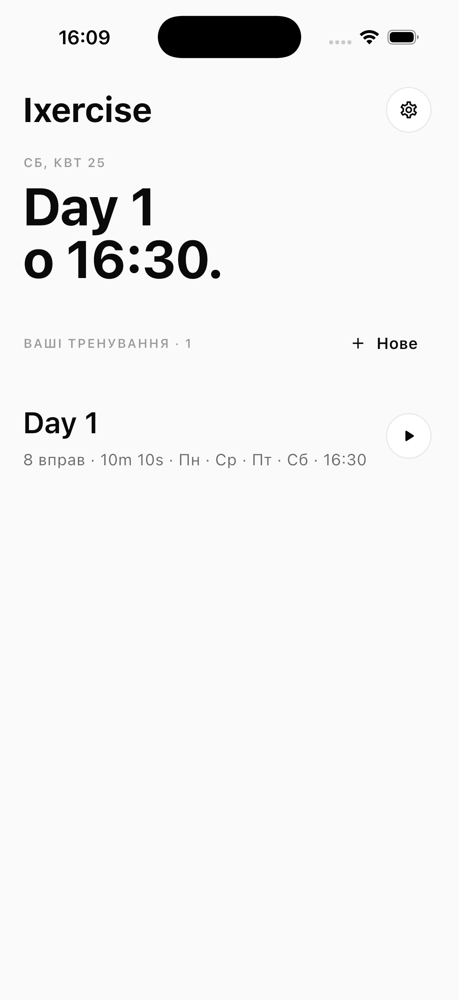
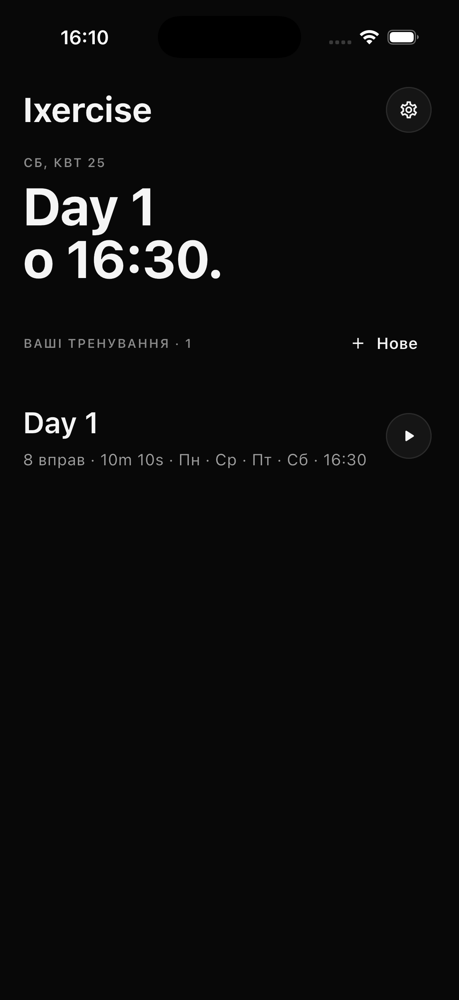
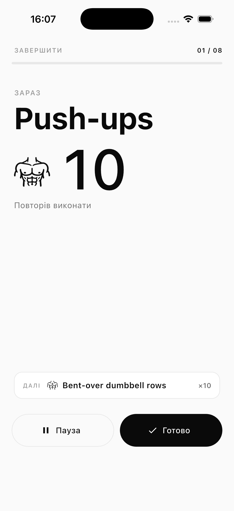
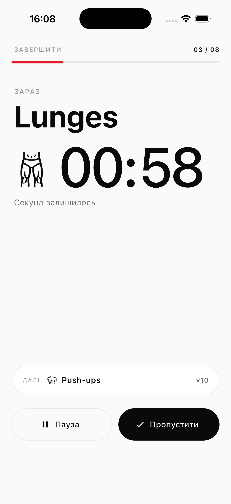
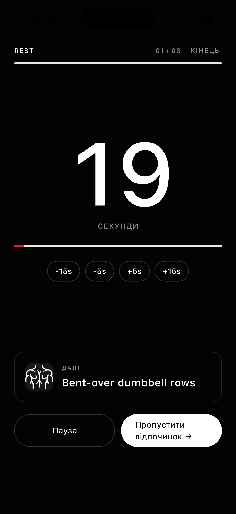
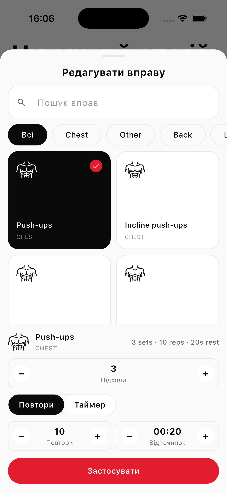
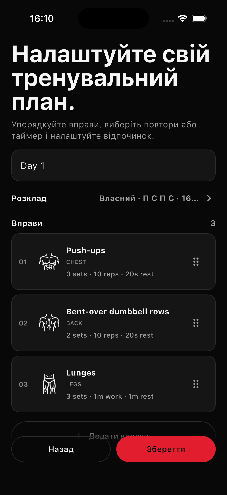
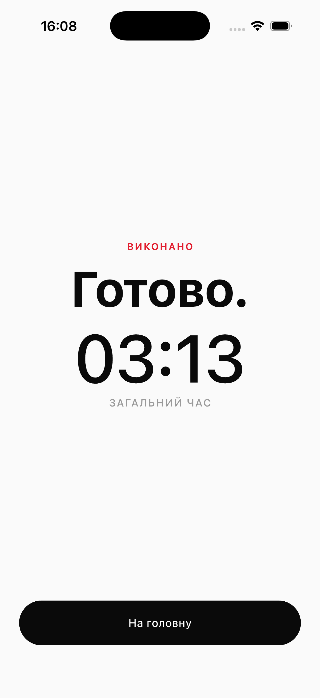

# Ixercise

**Your workout. Step by step. Offline.**

Ixercise is a simple offline workout app for iOS that guides you through your own routines with reps, timers, rest screens, reminders, Live Activities, and Dynamic Island support.

---

## Philosophy

Not another fitness tracker.

- No calorie tracking
- No streaks
- No social feed
- No video lessons
- No account
- No cloud
- No tracking

Just your workout, step by step.

---

## Features

| Feature | Status |
|---|---|
| Fully offline | ✓ |
| No account required | ✓ |
| No cloud sync | ✓ |
| No tracking or analytics | ✓ |
| Custom workout routines | ✓ |
| Reps-based exercises | ✓ |
| Timer-based exercises | ✓ |
| Rest countdown | ✓ |
| Workout reminders | ✓ |
| Lock Screen / Live Activities | ✓ |
| Dynamic Island support | ✓ |
| Light and dark mode | ✓ |
| English and Ukrainian | ✓ |
| Free and open source | ✓ |

---

## Screenshots

| | | |
|---|---|---|
|  |  |  |
| Home | Home + Reminder | Home (Dark) |
|  |  |  |
| Active Exercise — Reps | Active Exercise — Timer | Rest Countdown |
|  |  |  |
| Exercise Editor | Workout Editor | Done |

> See [`docs/SCREENSHOTS_COPY.md`](docs/SCREENSHOTS_COPY.md) for App Store overlay copy.

---

## Privacy

Ixercise does not collect, transmit, sell, share, or analyze user data.

Workouts stay on your device. No internet connection is required. No account is needed. Full details: [PRIVACY_POLICY.md](PRIVACY_POLICY.md)

---

## Development

**Requirements:**
- Flutter SDK (see `pubspec.yaml` — SDK constraint `^3.11.5`)
- Xcode (for iOS builds)

```bash
# Install dependencies
flutter pub get

# Run on a connected device or simulator
flutter run

# Run unit and widget tests
flutter test

# Run integration tests
flutter test integration_test/app_flow_test.dart -r expanded
```

---

## App Store

Ixercise is planned for App Store release. See [`docs/APP_STORE_METADATA.md`](docs/APP_STORE_METADATA.md) for metadata and [`docs/RELEASE_CHECKLIST.md`](docs/RELEASE_CHECKLIST.md) for the release process.

---

## Roadmap

Planned, not yet implemented:

- [ ] Import / export workouts
- [ ] Share workout
- [ ] Built-in workout templates
- [ ] Better accessibility

---

## Contributing

Contributions are welcome. Open an issue first to discuss larger changes. Bug reports, feature ideas, and translations are appreciated.

Templates: [bug report](.github/ISSUE_TEMPLATE/bug_report.md) · [feature request](.github/ISSUE_TEMPLATE/feature_request.md)

---

## License

[MIT](LICENSE) © 2026 Ilya Serbin
